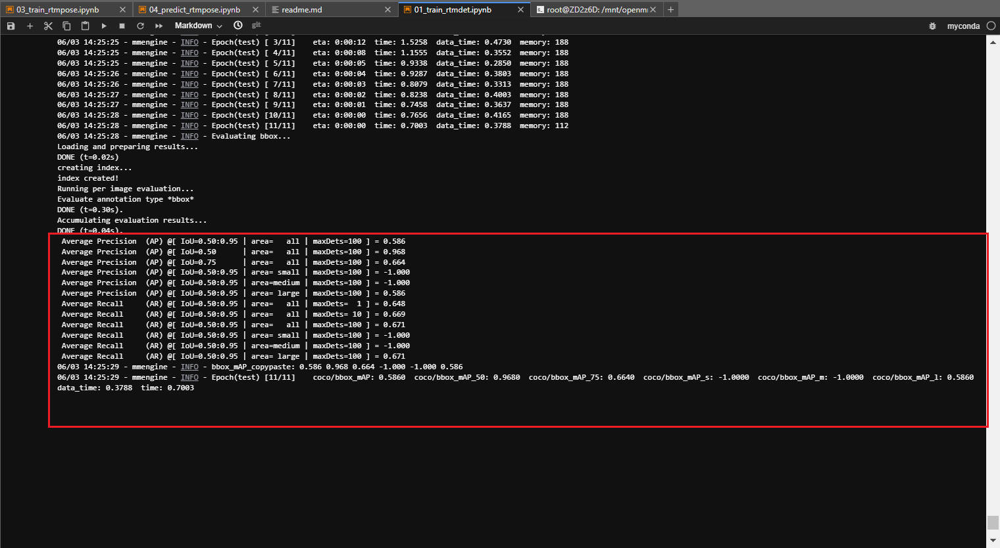
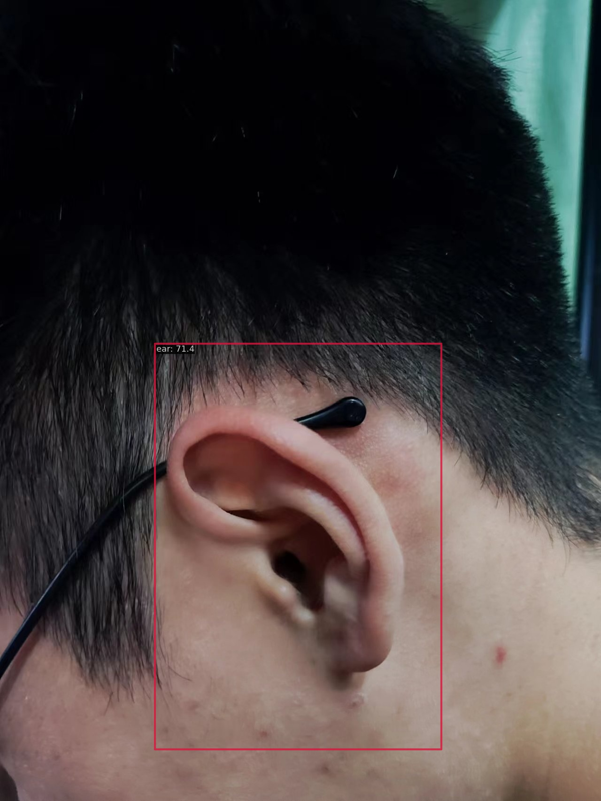
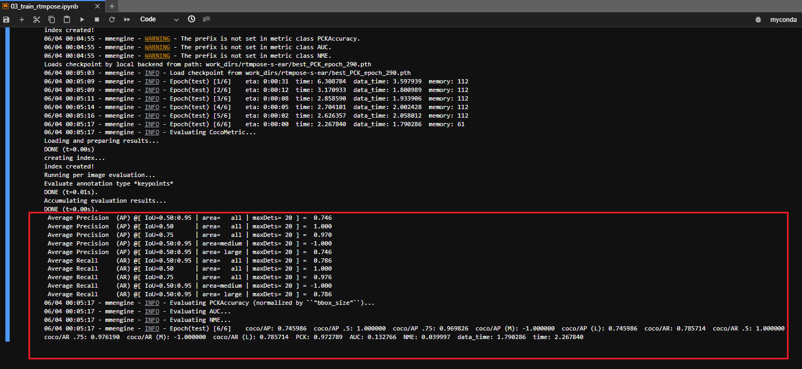
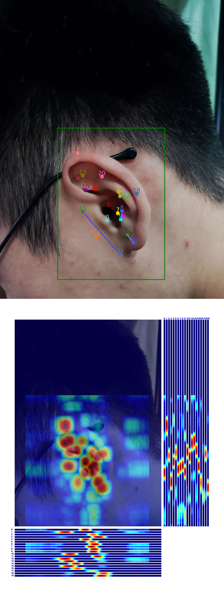

## 第一次作业供大家参考：

### 前言
- github仓库中要包含config 文件、日志文件（.json或者.log都可以）、测试集的评估指标、预测结果图；

- 最主要是rtmdet和rtmpose两个模型的测试集评估指标以及预测图，最好将评估指标和预测图贴在readme.md中。

- 但如果没有上传其他相关训练、日志文件作为依据，只有如下评估指标和预测图无法确定是你本人做的；

- 文件说明：

  - rtmdet训练代码见:[01_train_rtmdet.ipynb](01_train_rtmdet.ipynb)

  - rtmdet预测代码见:[02_predict_rtmdet.ipynb](02_predict_rtmdet.ipynb)

  - rtmdet训练日志见:[rtmdet-train-20230603_134747.log](rtmdet-train-20230603_134747.log)

  - rtmdet测试集评估日志见:[rtmdet-test-20230603_142507.log](rtmdet-test-20230603_142507.log)

  - rtmpose训练代码见:[03_train_rtmpose.ipynb](03_train_rtmpose.ipynb)

  - rtmpose预测代码见:[04_predict_rtmpose.ipynb](04_predict_rtmpose.ipynb)

  - rtmpose训练日志见:[rtmpose-train-20230603_155157.log](rtmpose-train-20230603_155157.log)

  - rtmpose测试集评估日志见:[rtmpose-test-20230604_000432.log](rtmpose-test-20230604_000432.log)

---

### RTMDet:

- 测试集评估指标如下（epoch=80）：

  

- 预测单张图片结果如下：

  

---

### RTMPose:

- 测试集评估指标如下（epoch=300）：

  

- 预测单张图片结果如下：

  

